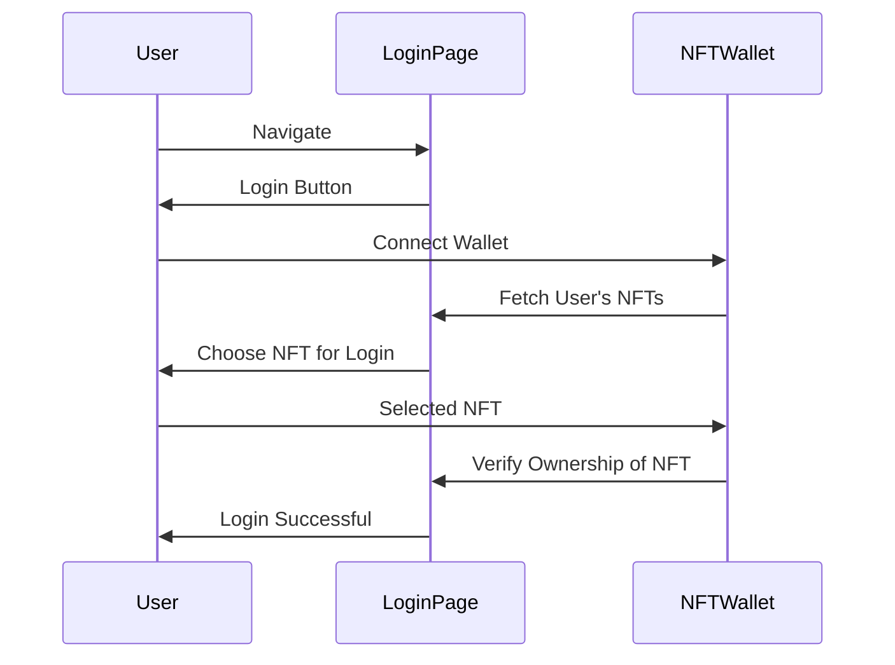

# Climeta Contracts
This is the repository for the blockchain code for Climeta.

Climeta is a community driven conservation funding mechanism allowing brands and benefactors to donate to Climeta.

Charitable projects put forward pitches to the Climeta community and the community votes on those pitches to determine where the funding goes.

To become a member of Climeta, you purchase a DelMundo NFT. This is both a membership token which grants you a single vote in each voting round.

There are reward tokens given  out for good behaviour of DelMundos in Climeta, and the main mechanism is by voting.

There is a reward for voting as well as a mechanism to get extra rewards at vote end. The owners of the voting DelMundos get the rewards. 

Each DelMundo accrues Raycognition when doing good deems. This is a token that is non-transferable. These tokens are minted directly to ERC6551 wallets for every DelMundo. 

These raycognition tokens help determine the allocation of Raywards at the end of each voting round.

Raywards can be used in the Climeta marketplace to redeem various exclusive digital assets and to get early access to all manner of brand and art generated content.

The DelMundos are ERC721 NFTs. Token 0 is Ray DelMundo himself, one of the core characters of the Climeta ecosystem. The ERC6551 wallet for Ray is the Climeta Reward Pool.
All Raywards come from Ray himself. This Del Mundo is owned by Climeta, although the reality is that no-one can own Ray.

In a future release, new NFT traits will be released, which are ERC1155 NFTs with fixed supplies. This is enforced in the ERC1155 contract. These can be traded and be used to swap the clothes/attributes of the
Del Mundos themselves. These trait NFTs are stored in the ERC6551 wallets and must be owned in order to change the DelMundo NFT itself. 

The owner of the DelMundo cannot sell a trait if the DelMundo is wearing it. 

## Design

The core token contracts are OpenZeppelin based ERC721, ERC20 and ERC1155 solidity contracts. Where the Climeta tokens differ is in the redeeming process for 
the Del Mundos and the fact that the ERC1155 tokens cannot have more minted than the total created when first created. This means each token id has a fixed supply. 

The main climeta contract follows the Diamond pattern. It makes use of the DiamondStorage as well as the ApplicationStorage patterns.

The ClimetaStorage struct contains all the references to important contract addresses, such as the deployed token addresses, as well as some initial global variable values.
The AdminFacet contract contains functions to administer and retrieve these values.

The other Facets manage Donations, Voting, Boutique (marketplace), Ownership alongside the core Diamond functionalities which follow the Diamond version 3 pattern.

Contract ownership is handled via a library of Diamond functions and each Climeta Facet also has an interface which helps in testing as well as keeping things nice and neat.

The Diamond pattern was chosen for 2 main reasons. 

 * The first is to have a single address for all of Climeta, forever. This allows ENS names and other naming services to be used.
 * The second is that Climeta is designed to evolve with the community and to have functionality added on an ongoing basis and this 
 upgrade pattern is significantly cleaner in the eyes of Ray and myself than other upgradeable proxy patterns.

## Install

Install foundry using foundryup. 

Install the contract dependencies:

```bash
forge install OpenZeppelin/openzeppelin-contracts-upgradeable --no-commit
forge install OpenZeppelin/openzeppelin-contracts --no-commit
forge install tokenbound=tokenbound/contracts --no-commit
forge install tokenbound=tokenbound/erc6551 --no-commit
forge install OpenZeppelin/openzeppelin-foundry-upgrades --no-commit
```

Then add in the remappings in foundry.toml

```toml
remappings = ["@openzeppelin/contracts=lib/openzeppelin-contracts/contracts","@openzeppelin/contracts-upgradeable=lib/openzeppelin-contracts-upgradeable/contracts","@tokenbound/contracts=lib/tokenbound/src","@tokenbound/erc6551=lib/tokenbound/lib/erc6551/src"]
```

## Style Guide

The Solidity code follows a simple style which is mostly adhered to, unless there are functional grouping reasons to do otherwise.

* Pragma statements
* Import statements
* Events
* Errors
* Interfaces
* Libraries
* Contracts

* Type declarations
* State variables
* Events
* Errors
* Modifiers
* Functions

## Deployments

The deployment of Climeta has been encoded into a series of DeployScripts, which are used by the tests and can also be used to directly deploy contracts to local test-nets as well as the blockchain test and main-nets.

Before running full test suites, we need to deploy to a local chain to validate we have the correct addresses set up in the `.env` file and that the right public/private key pairs from the anvil setup are also loaded in

These DeployScripts need to be run in a particular order when using outside of _forge test_ runs. This is all managed by a `.env` file.

```dotenv
ANVIL_DEPLOYER_PRIVATE_KEY=
ANVIL_DEPLOYER_PUBLIC_KEY=
DEPLOYER_PRIVATE_KEY=
DEPLOYER_PUBLIC_KEY=
ANVIL_RPC_URL=http://127.0.0.1:8545
BASE_MAINNET_RPC=
BASE_SEPOLIA_RPC=
CHAINID=31337
DELMUNDO_ADDRESS=
OPS_TREASURY_ADDRESS=
RAYWARD_ADDRESS=
RAYCOGNITION_ADDRESS=
DELMUNDOWALLET_ADDRESS=
REGISTRY_ADDRESS=
RAYWALLET_ADDRESS=
CLIMETA_ADDRESS=
```

The foundry.toml file can also be amended to include some rpc-url shortcuts :
```toml
[rpc_endpoints]
anvil="${ANVIL_RPC_URL}"
base_mainnet="${BASE_MAINNET_RPC}"
base_sepolia="${BASE_SEPOLIA_RPC}"
```

### Deploying to a local anvil chain

Once the local chain is running, then we need to add the first account's public and private key to the .env file for `ANVIL_DEPLOYER_XXXXX_KEY` respectively. There is another DEPLOYER_KEY pair of variables
which can be used for deploying to actual test-nets and main-net. The run() will use the ANVIL_ variables, so when deploying locally, you simply need to run the following command: 

```bash
forge script script/DeployAll.s.sol --rpc-url anvil --broadcast
```

To deploy to a real blockchain which will use the DEPLOYER_PRIVATE_KEY you can call the `deploy` function in these files.

```bash
forge script script/DeployAll.s.sol --sig "deploy()" --rpc-url base_sepolia --broadcast
```
This deployment will output the contract addresses of the contracts deployed. These can then be put in the .env file above and these will be used in subsequent files. On Anvil deploys, assuming you restart anvil each time, the addresses will always be the same, which makes things easier.
This script deploys all the token contracts as well as the reference implementation tokenbound registry contract from tokenbound.org, which allows the ERc6551 functionality to work just as it would on the real blockchain.

The ERC6551 Accounts is a climeta contract, but the registry is a reference registry and would not need to be deployed to Base itself, we would simply use the tokenbound registry directly.

Once the token and utility contracts have been deployed, you can deploy the main Climeta Diamond contracts for the framework itself, the Diamond itself, Loupe, Ownership and Cut contracts.

There are init contracts that can be called to set some starting values, and this includes all the references to the contract addresses when deploying the ClimetaStorage contract.

```bash
forge script script/DeployClimetaDiamond.s.sol --rpc-url anvil --broadcast
```
This is then followed by the Facets. There are helper contracts written which will automatically inspect the Facets and create the functions lists and pass these to the FacetLoupe functions to set everything up correctly.

```bash
forge script script/DeployAdminFacet.s.sol --rpc-url anvil --broadcast
forge script script/DeployDonationFacet.s.sol --rpc-url anvil --broadcast
forge script script/DeployVotingFacet.s.sol --rpc-url anvil --broadcast
```

All the facets have interfaces which help with testing and calling functions against the Climeta contract directly.

There are a couple of simple status contract scripts which query basic status metrics from Climeta and print them out as helpers. This is the ClimetaStatus.s.sol script. 

To upgrade a Facet, there is an example script which contains the removal of previous and adding of new, which also covers the changes that happen to the interfaces.

## Testing

Once this has been deployed to a local chain, and your `.env` file has been updated, then you can run the standalone tests:

```bash
forge test
```

```bash
forge coverage
```





## Functionality

### Voting round setup

To add a proposal into the voting round, beneficiaries must first be approved by Climeta to be able to submit proposals.

Once approved, then beneficiaries can either submit the proposals themselves or Climeta can do on their behalf. The proposal
consists of an IPFS uri which contains the proposal itself. The format of this proposal is not important for the smart contracts.

Once added, a new proposal id is returned.

For each voting round, the Climeta admins add the chosen proposals into the voting round so they can be voted on. Proposals cannot be added 
into multiple voting rounds, nor can they be removed once a voting round has started (ie the first vote has been cast).

Once added to a voting round, members are free to cast votes. The app will do the checks to ensure all proposals in a voting round are watched, this is not
mandated on chain.

### Donations

Climeta does not accept direct ETH transfers. It has the ability to accept donations via donation function calls which are within the DonationFacet.

The contract can accept native ETH as well as ERC20 tokens. The type of ERC20 tokens are restricted and managed by Climeta. This prevents weird ERC20s flowing through the system.

The donate functions also allow tracking of the donators and are a key part of the mechanism for capital flow through Climeta. Once donated, 10% of the donation is 
moved to the operations wallet owned by Climeta. The remainder is then available for the charities to pitch for. 


### Voting

Once in a voting round, then the proposals can be voted on by the Climeta membership.

Each voting round is allocated a certain amount of Raywards, given by `ClimetaStorage.votingRoundReward`.

Each DelMundo is allowed a single vote. A user with multiple DelMundos can vote multiple times, but only once per DelMundo. 
This is implemented via an ERC6551 wallet associated with each DelMundo, so the user will be logged on to the Climeta App with their DelMundo
and when they vote, it is that DelMundo which calls the castVote function on the Climeta contract via a delegateCall. 

The castVote function call is called via this wallet so that the DelMundo itself can be identified from the call and validated.

Each individual vote is rewarded directly with a fixed amount of Raywards given by `ClimetaStorage.voteReward`.
In addition to the Raywards, a vote generates Raycognition, which is implemented as an ERC20 token which cannot be transferred.
This is sent to the wallet of the DelMundo, and the amount is determined by `ClimetaStorage.voteRaycognitionAmount`. This token cannot be transferred, so will accumulate in the 
Del Mundo wallet forever.

At the end of the voting period (which is determined externally by Climeta), the ClimetaAdmins execute the endVotingRound function.

In this function, the votes are added up. The distribution of funds works as follows:

* 10% of the fund is split across all participating beneficiaries.
* 90% of the fund is split across the beneficiaries pro rata by vote count.

The funds are not sent to the charities. Those charities have to come and withdraw their winning funds. This pull method is far more scalable and secure than pushing on vote end and not subject to a failure of any one
push. There is a push method included to that Climeta can push specific winnings to a specific winning Charity wallet if necessary.

This withdraw approach is also found across Climeta for the same reasons as stated above. This includes the Raywards, but not the Raycognition, which are sent out individually with the vote reward.

The remaining rewards for the voting round are then distributed. This total is ClimetaStorage.votingRoundReward - (total votes * ClimetaStorage.voteReward) 
where ClimetaStorage.votingRoundReward will always be bigger (if not then the endVotingRound call will fail until the admins increase the amount per round!

This remainder is then distributed according to the following logic:

* 50% of the remaining Raywards are split evenly across all participating beneficiaries.
* 50% is split between the participating DelMundos according the pro rata distribution of Raycognition of the DelMundos involved.

An example.

Charity 1 pitches proposal A
Charity 2 pitches proposal B

User1 owns DelMundo 1 which has 600 Raycognition and DelMundo 2 which has 0
User2 owns DelMundo 3 has 0 Raycognition
User3 owns DelMundo 4 has 0 Raycognition
There is 1,000,000 USDC in the treasury.

The voting round has 500,000 Raywards allocated. Each vote earns 5,000. Raycognition for voting is 200.

DelMundo 1, 2 and 3 vote for A
DelMundo 4 votes for B.

Each DelMundo earns 200 Raycognition. User1 gets 10,000 raywards for voting, User2 and User3 earn 5,000.

### At vote end:

#### Users

* Charity 1 gets awarded : 50,000 + (900,000 * 3/4) = 725,000 USDC
* Charity 2 gets awarded : 50,000 + (900,000 * 1/4) = 275,000 USDC

#### Users 

Total rewards left : 5000,000 - (4 * 5000) = 480,000
 
50% even split : each user gets 240,000/4 = 60,000

50% Raycognition split : 240,000 
User1 has 1000/1400 raycognition, User2, User3 have 200/1400 raycognition each. 

* User1 gets an additional : 120,000 + (240,000 * 1000/1400) = 291428.57 Raywards
* User2 gets an additional : 60,000 + (240,000 * 200/1400) = 94285.71 Raywards
* User3 gets an additional : 60,000 + (240,000 * 200/1400) = 94285.71 Raywards

It is worth noting again that these Raywards are available to be withdrawn from Climeta. This is done via the `withdrawRaywards` function.

Each voting DelMundo's Raycognition total has gone up by 200.  

The end of a voting round increments the voting round and we are then ready for the next set of proposals to be added and for more donations to come in.


