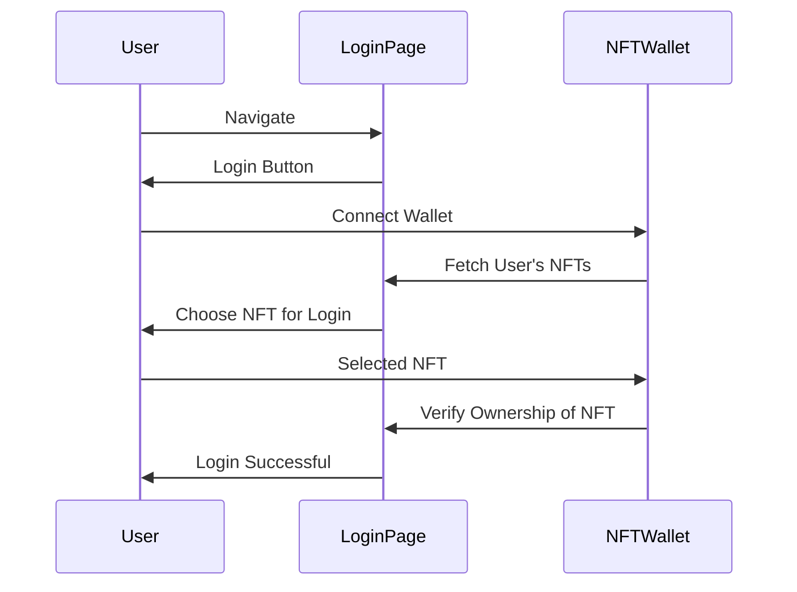

# Climeta Contracts

## Summary

## Install

Install the contract dependencies:

```bash
forge install OpenZeppelin/openzeppelin-contracts-upgradeable --no-commit
forge install OpenZeppelin/openzeppelin-contracts --no-commit
```

Then add in the remappings in foundry.toml


## Style Guide

* Pragma statements
* Import statements
* Events
* Errors
* Interfaces
* Libraries
* Contracts

* Type declarations
* State variables
* Events
* Errors
* Modifiers
* Functions


