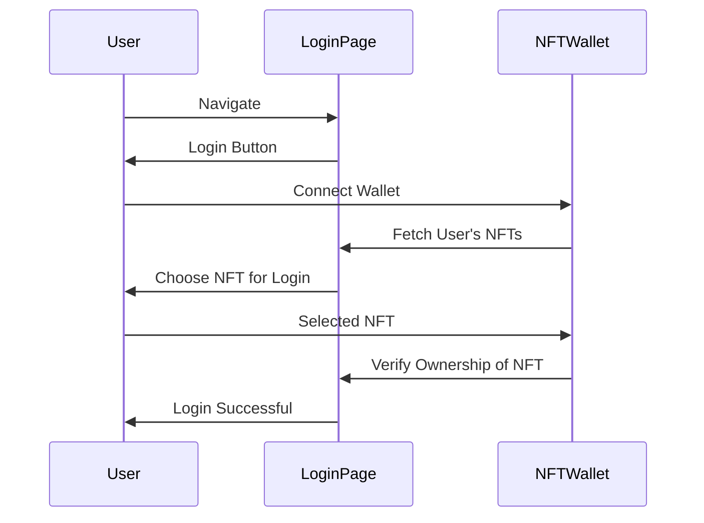

# Climeta Contracts

This is the repository for the blockchain code for Climeta.

Climeta is a community driven conservation funding mechanism allowing brands and benefactors to donate to Climeta.

Charitable projects put forward pitches to the Climeta community and the community votes on those pitches to determine where the funding goes.

To become a member of Climeta, you purchase a DelMundo NFT. This is both a membership token which grants you a single vote in each voting round.

There are reward tokens given  out for good behaviour of DelMundos in Climeta, and the main mechanism is by voting.

There is a reward for voting as well as a mechanism to get extra rewards at vote end. The owners of the voting DelMundos get the rewards. 

Each DElMundo accrues Raycognition when doing good deems. This is a token that is non-transferable. These tokens are minted directly to ERC6551 wallets for every DelMundo. 

These raycognition tokens help determine the allocation of Raywards at the end of each voting round.

Raywards can be used in the Climeta marketplace to redeem various exclusive digital assets and to get early access to all manner of brand and art generated content.

The DelMundos are ERC721 NFTs. Token 0 is Ray DelMundo himself, one of the core characters of the Climeta ecosystem. The ERC6551 wallet for Ray is the Climeta Reward Pool.
All Raywards come from Ray himself.

In a future release, new NFT traits will be released, which are ERC1155 NFTs with fixed supplies. These can be traded and be used to swap the clothes/attributes of the
Del Mundos themselves. These trait NFTs are stored in the ERC6551 wallets and must be owned in order to change the DelMundo NFT itself. 

The owner of the DelMundo cannot sell a trait if the DelMundo is wearing it. 

## Design

The core token contracts are standard solidity OpenZeppelin based ERC721, ERC20 and ERC1155 contracts.

The main climeta contract follows the Diamond pattern. It makes use of the DiamondStorage as well as the ApplicationStorage patterns.

The ClimetaStorage struct contains all the references to important contract addresses, such as the deployed token addresses, as well as some initial global variable values.
The AdminFacet contract contains functions to administer and retrieve these values.

The other Facets manage Donations, Voting, Boutique (marketplace), Ownership alongside the core Diamond functionalities which follow the Diamond version 3 pattern. 

The Diamond pattern was chosen for 2 main reasons. 

 * The first is to have a single address for all of Climeta, forever. This allows ENS names and other naming services to be used.
 * The second is that Climeta is designed to evolve with the community and to have functionality added on an ongoing basis and this upgrade pattern is significantly cleaner in the eyes of Ray and myself than other upgradeable proxy patterns

## Install

Install the contract dependencies:

```bash
forge install OpenZeppelin/openzeppelin-contracts-upgradeable --no-commit
forge install OpenZeppelin/openzeppelin-contracts --no-commit
forge install tokenbound=tokenbound/contracts --no-commit
forge install tokenbound=tokenbound/erc6551 --no-commit
forge install OpenZeppelin/openzeppelin-foundry-upgrades --no-commit
```

Then add in the remappings in foundry.toml

```bash
remappings = ["@openzeppelin/contracts=lib/openzeppelin-contracts/contracts","@openzeppelin/contracts-upgradeable=lib/openzeppelin-contracts-upgradeable/contracts","@tokenbound/contracts=lib/tokenbound/src","@tokenbound/erc6551=lib/tokenbound/lib/erc6551/src"]
```

## Testing

Once the dependencies are configured, all that is required is to 

```bash
forge test
```

This will run all the unit tests as well as the invariant and formal verification tests.


## Style Guide

The Solidity code follows a simple style which is mostly adhered to, unless there are functional grouping reasons to do otherwise.

* Pragma statements
* Import statements
* Events
* Errors
* Interfaces
* Libraries
* Contracts

* Type declarations
* State variables
* Events
* Errors
* Modifiers
* Functions

## Deployments

The deployment of Climeta has been encoded into a series of DeployScripts, which are used by the tests and can also be used to directly deploy contracts to local test-nets as well as the blockchain test and main-nets.

These DeployScripts need to be run in a particular order when using outside of _forge test_ runs. This is all managed by a .env file.

```dotenv
ANVIL_DEPLOYER_PRIVATE_KEY=
ANVIL_DEPLOYER_PUBLIC_KEY=
DEPLOYER_PRIVATE_KEY=
DEPLOYER_PUBLIC_KEY=
ANVIL_RPC_URL=http://127.0.0.1:8545
BASE_MAINNET_RPC=
BASE_SEPOLIA_RPC=
CHAINID=31337
DELMUNDO_ADDRESS=
CLIMETA_ADDRESS=
OPS_TREASURY_ADDRESS=
RAYWARD_ADDRESS=
RAYCOGNITION_ADDRESS=
DELMUNDOWALLET_ADDRESS=
REGISTRY_ADDRESS=
RAYWALLET_ADDRESS=
```

The foundry.toml file can also be amended to include some rpc-url shortcuts :
```toml
[rpc_endpoints]
anvil="${ANVIL_RPC_URL}"
base_mainnet="${BASE_MAINNET_RPC}"
base_sepolia="${BASE_SEPOLIA_RPC}"
```

### Deploying to a local anvil chain

Once the local chain is running, then we need to add the first account's public and private key to the .env file for `ANVIL_DEPLOYER_XXXXX_KEY` respectively. There is another DEPLOYER_KEY pair of variables
which can be used for deploying to actual test-nets and main-net. The run() will use the ANVIL_ variables, so when deploying locally, you simply need to run the following command: 

```bash
forge script script/DeployAll.s.sol --rpc-url anvil --broadcast
```

To deploy to a real blockchain which will use the DEPLOYER_PRIVATE_KEY you can call the `deploy` function in these files.

```bash
forge script script/DeployAll.s.sol --sig "deploy()" --rpc-url base_sepolia --broadcast
```
This deployment will output the contract addresses of the contracts deployed. These can then be put in the .env file above and these will be used in subsequent files. On Anvil deploys, assuming you restart anvil each time, the addresses will always be the same, which makes things easier.
This script deploys all the token contracts as well as the reference implementation tokenbound registry contract from tokenbound.org, which allows the ERc6551 functionality to work just as it would on the real blockchain.

The ERC6551 Accounts is a climeta contract, but the registry is a reference registry and would not need to be deployed to Base itself, we would simply use the tokenbound registry directly.

Once the token and utility contracts have been deployed, you can deploy the main Climeta Diamond contracts for the framework itself, the Diamond itself, Loupe, Ownership and Cut contracts.

There are init contracts that can be called to set some starting values, and this includes all the references to the contract addresses when deploying the ClimetaStorage contract.

```bash
forge script script/DeployClimetaDiamond.s.sol --rpc-url anvil --broadcast
```
This is then followed by the Facets. There are helper contracts written which will automatically inspect the Facets and create the functions lists and pass these to the FacetLoupe functions to set everything up correctly.

```bash
forge script script/DeployAdminFacet.s.sol --rpc-url anvil --broadcast
forge script script/DeployDonationFacet.s.sol --rpc-url anvil --broadcast
forge script script/DeployVotingFacet.s.sol --rpc-url anvil --broadcast
```

All the facets have interfaces which help with testing and calling functions against the Climeta contract directly.

There are a couple of simple status contract scripts which query basic status metrics from Climeta and print them out as helpers. This is the ClimetaStatus.s.sol script. 

When deploying a new version of a Facet, unless there are no functions added or removed, then you need to run a Remove of the old before
Adding a new one as replace will simply replace each function in the array.





## Functionality

### Voting round setup

To add a proposal into the voting round, beneficiary projects must first be approved by Climeta to be able to submit proposals.

Once approved, then beneficiaries can either submit the proposals themselves or Climeta can do on their behalf. The proposal
consists of an IPFS uri which contains the proposal itself. The format of this proposal is not important for the smart contracts.

Once added, a new proposal id is returned.

For each voting round, the Climeta admins add the chosen proposals into the voting round so they can be voted on. Proposals cannot be added 
into multiple voting rounds.

Once added to a voting round, members are free to cast votes. The app will do the checks to ensure all proposals in a voting round are watched, this is not
mandated on chain.

### Voting

Once in a voting round, then the proposals can be voted on by the Climeta membership.

Each voting round is allocated a certain amount of Raywards, given by ClimetaStorage.votingRoundReward.

Each DelMundo is allowed a single vote. A user with multiple DelMundos can vote multiple times, but only once per DelMundo. 
This is implemented via an ERC6551 wallet associated with each DelMundo. 

The castVote function call is called via this wallet so that the DelMundo itself can be identified from the call and validated.

Each individual vote is rewarded directly with a fixed amount of Raywards given by ClimetaStorage.voteReward.
In addition to the Raywards, a vote generates Raycognition, which is implemented as an ERC20 token which cannot be transferred.
This is sent to the wallet of the DelMundo, and the amount is determined by ClimetaStorage.voteRaycognitionAmount.

At the end of the voting period (which is determined externally by Climeta), the ClimetaAdmins execute the endVotingRound function.

In this function, the votes are added up. The distribution of funds works as follows:

* 10% of the fund is split across all participating beneficiaries.
* 90% of the fund is split across the beneficiaries pro rata by vote count.

The remaining Raywards from the initial allocation minus all the individual vote rewards are then distributed as follows:

* 50% of the remaining Raywards are split evenly across all participating beneficiaries.
* 50% are then split between the participating DelMundos according the pro rata distribution of Raycognition of the DelMundos involved.
 


