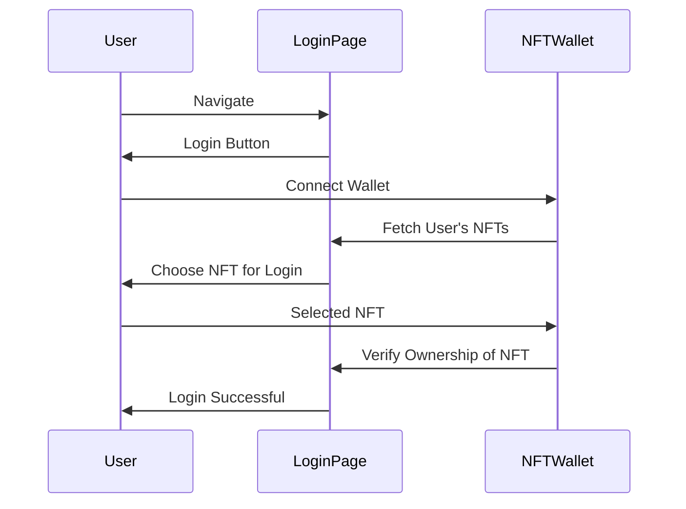

# Climeta Contracts

## Summary


## Install

Install the contract dependencies:

```bash
forge install OpenZeppelin/openzeppelin-contracts-upgradeable --no-commit
forge install OpenZeppelin/openzeppelin-contracts --no-commit
```

Then add in the remappings in foundry.toml


## Style Guide

* Pragma statements
* Import statements
* Events
* Errors
* Interfaces
* Libraries
* Contracts

* Type declarations
* State variables
* Events
* Errors
* Modifiers
* Functions



### Invariants

 * Ray is the only one who gives out raywards
 * total supply of DelMundos is never more than DelMundo.s_currentMaxSupply
 * Ray (DelMundo tokenID 0) should always have enough reward tokens to distribute.
 * No DelMundo can vote more than once per voting round
 * Rayputation can only be earned, not traded
 * 


## Deployments

To deploy the contracts, run the following command:

```bash
forge deploy
```


When deploying a new version of a Facet, unless there are no functions added or removed, then you need to run a Remove of the old before 
Adding a new one as the replace will simply replace each function in the array. 